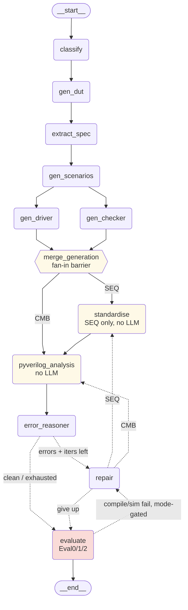

# LangGraph Pipeline — Visual Diagram

> Reflects the current graph in `pipeline/graph.py` (nodes, parallel branches,
> the SEQ-only `standardise` step, and both repair re-entry paths). Companion to
> `docs/pipeline_walkthrough.md` (node-by-node explanation).

**Notes**
- `gen_driver` and `gen_checker` run as **parallel branches**; `merge_generation`
  is a fan-in barrier that waits for both.
- `standardise` runs **only for SEQ** circuits (CMB skips straight to analysis).
- Two repair entry points: from `error_reasoner` (static/Pyverilog errors) and from
  `evaluate` (compile/simulation failure) — the latter is **mode-gated** (only
  `compiler_only` and `hybrid` re-enter on simulation feedback).
- `repair` regenerates the testbench and routes back into analysis, not straight to
  evaluation, so the fix is re-checked before grading.
- Deterministic nodes (yellow) use **no LLM**: `merge_generation`,
  `standardise`, `pyverilog_analysis` (and `evaluate` runs Icarus Verilog).

> The `pipeline_graph.png` in this folder is an **older** render (pre-`gen_dut`); the
> Mermaid above is the source of truth. Regenerate the PNG from this block if needed.